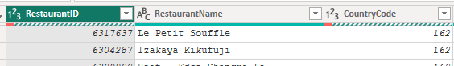

## 1. Understand the Dataset

At first, understand the dataset. Go through all of the columns in the dataset, and make a synopsis about what story the dataset is going to tell us. 

The columns mentioned in the dataset:

1. Restaurant ID (Unique key for a restaurant)
2. Restaurant Name
3. Country Code
4. City 
5. Address (Restaurant Address)
6. Locality 
7. Locality Verbose (Specific details about locality)
8. Longitude
9. Latitude
10. Cuisines
11. Currency
12. Has_table_booking (The restaurant has the table booking option or not)
13. Has_online_delivery (The restaurant has the online delivery option or not)
14. Is_delivering_now (Is the restaurant giving delivery service now?)
15. Switch_to_order_menu (The only option mentioned is "No". That means, it's of no use)
16. Price_range (Expensive or Cheap Rating)
17. Votes (Total count of votes)
18. Average_cost_for_two 
19. Rating (Average rating)

## 2. Client meeting and knowing their requirements

After meeting with clients, the business intelligence will list down all of the requirements. Then, they will find the relevant questions to answer with the visualization they will create. 

Probable requirements are: 

1. No. of restaurants
2. Ratings
3. Segregate the data if they are delivering or not. 
4. Does the `location` impact the `Average Cost`?

I am adding some of the questions on my own:

1. What's the average rating point under each price ranged restaurant?
2. Rate the restaurants with "Top Rated","Good","Bad". 
3. Does average price range in restaurants of a particular city define purchasing power of people for a particular locality?

Based on the research, create a plan with:

1. Construct Porter's 5 forces for some specific cities. 
2. Zomato's next year expansion plan. 
3. Timeline of the strategies. 
4. How the initial marketing approach should be based on this dataset?
5. Define Offers for new customers in new expanded areas to boost revenue. 

## 3. Transformation and Load

#### 1. Red Marks in Columns

The **red** marks in "Country Code" and "Restaurant ID" helps us to identify "There are some errors to this column". 

**Solution**: 

0. First, select a column you want to remove errors. 
1. Go to `Remove Rows` in Home tab.
2. Select `Remove Errors`
